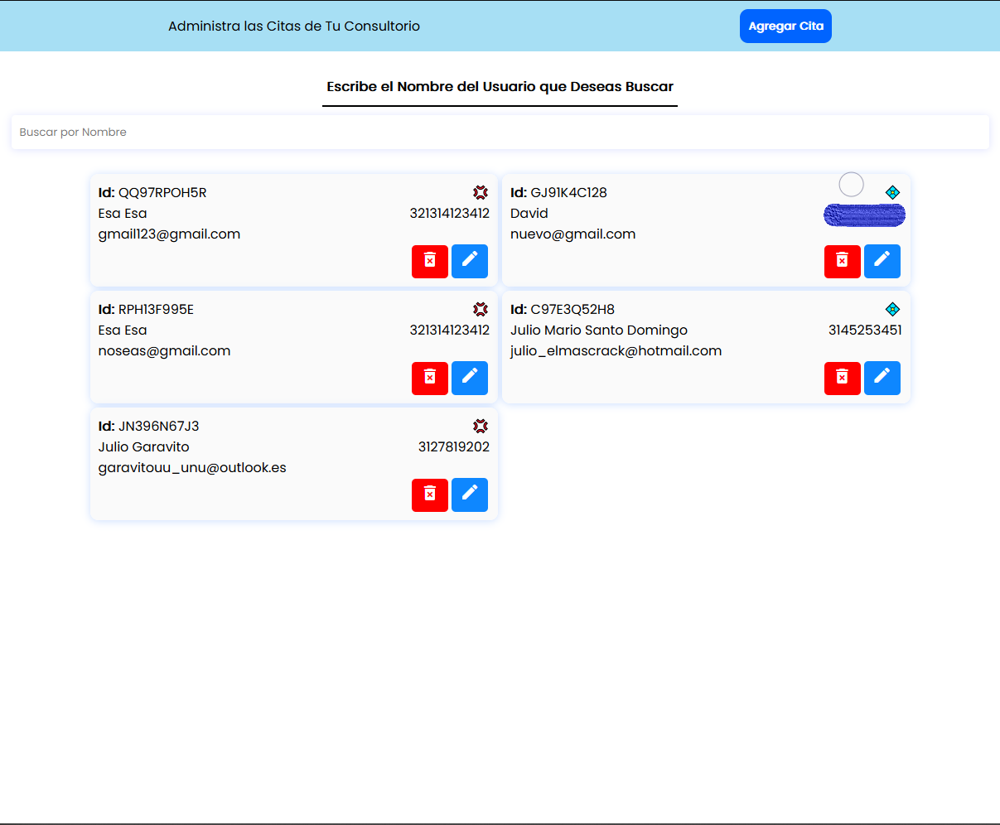

# Maneja las Citas de Tu consultorio

## Mision
Permitir a nuestros usuarios de manera clara, optima y coherente de un Sistema de Gestión de Citas y Pacientes con Herramientas Internas que así lo permitan.

## __Vision__
Lograr permanecer en la esencia de la mision planteada, Optando siempre por la mejora del Aplicativo con funciones e Ideas Obtenidas sobre la marcha en el Desarrollo del Proyecto.

___

## __Objetivo General__
Realizar un  Aplicativo web  (SPA), que permita la gestión básica de citas y usuarios, con su información pertinente, Gestionando las citas según necesidad.

___
## __Objetivos Específicos__

- Desarrollar una interfaz Inteligente que permita la buena administración del Espacio (view Port) suministrado, accesible y Con un buen Diseño UX y UI.
- Establecer un Diseño de base de Datos JSON, para la administración de Pacientes, permitiendo al Software llegar a ser Escalable con nuevas tecnologías que se plateen en un futuro.
- Realizar su Funcionalidad con un Código limpio y modulado, siendo refactorizado con responsabilidad en Desarrollo para un buen entendimiento del Código.

___

## __Herramientas en el Desarrollo__
Establecer un Diseño y Visualización de la Información que se manejará en el Aplicativo, por medio de la Estructura inicial de nuestra página y sus Estilos.

* __HTML, CSS, Javascript__: Son el tridente base de Desarrollo en este Proyecto, los cuales han sido desarrollados según estrategias de Desarrollo de Software Web Adquiridos
a lo largo de mi estudio, a la vez que este proyecto me ha ayudado a identificar muchas de las maneras en las que se pueden evidenciar las problemáticas de Adaptación con cada una de
las tecnologíás de Desarrollo.

* __Sass__: El preprocesador por excelencia, dicha herramienta me permitió reusar el código escrito, crear mixins, variables, y de las cosas que más me gustan, es que la
especifidad no es un problema, ya que me permite acceder a los elementos en Arbol, al igual que usar sus punteros, me facilitó mucho el desarrollo de mis estilos.

* __GIT__: Sistema de Control de Versiones Distribuidas; Al usar esta herramienta en un Proyecto como este, en el cual intenté integrar muchas de las cosas que he aprendido, me hizo reevaluar el uso de muchos de los comandos; En varias ocasiones se me presentaban problemas y conocía los comandos para tratarlos pero no creía la importancia de los mismos, Agradezco mucho ese aprendizaje.

* __Json Sever__: Api local preconfigurada, me permitió proveer a mi App Web de una al cual realizar las peticiones; Aprendiendo así a aplicar el asincronismo de JavaScript con el navegador.

* __Five Server__: Esta herramienta me permitió crear un servidor local para visualizar el resultado de mi código al momento de guardar cambios. Un incidente que me tomó días, y creía que
era por culpa de mi código, era que al realizar el fetch sobre mi API local; evidentemente mi archivo [ .json ] se actualizaba y guardaba los cambios, Pues en dicho momento lo usaba
como extensión en VSCode, la cual al evidenciar el cambio en el archivo [ .json ] actualizaba mi App, Al darme cuenta instalé *__Five Server__* como Modulo en las Dependencias de
Desarrollo, El cual me permitió excluir dicho archivo y realizar demás configuraciones.

___

# __Vista del Proyecto__

## __Interfaz principal__
La Interfaz cuenta con varios detalles y a pensamiento de Desarrollador (no de un UX) se lograron algunos accesos intuitivos para su uso.

En la Página Principal de nuestra App tenemos varios campos de Interacción con validaciones y elementos que nos permiten ver la información de una manera minuciosa.

Como Usos principales de esta página, vemos un formulario inicial que nos permite agregar citas con id's de Usuario previamente existente, Dicho formulario cuenta con validaciones visibles para que el usuario detecte en qué parte se encuentra erronea su Información, Al igual que mensajes adentro del formulario cuando se trata de Información Inválida específica.

Otra de las Funcionalidades es la vista de Citas creadas, las citas que se encuentren pintadas de color es porque son anteriores a la fecha actual; Cada cita tiene su interacción dinámica.

Y el botón del Modal.

## __Modal para Agregar Usuarios__

Creo que el subtitulo lo explica muy bien de lo que se trata esta sección.

## __Vista de Usuarios__

La vista de usuarios se encuentra en una página independiente, la cual cuenta con un buscador en el caso de contener muchos usuarios, sea sencillo realizar la busqueda por medio del nombre del usuario; cada tarjeta de vista de usuario cuenta con sus funcionalidades base.

### __¿ Cómo funciona nuestro Botón de Editar en cada Usuario?__

Se preguntarán de qué manera realizaremos la edición de nuestro usuario si al hacer click en el botón, dicho botón nos traslada a otra página; Bueno, realmente es un enlace que funciona como botón, el cual lo que realiza es enviar por parámetros de *PATH* la información del usuario (_Mejor dicho, el Id del usuario en la Base de Datos .json_), Que al iniciar la página principal (_Es a donde nos envía dicho botón_) valida si existe dicho parámetro para realiza la acción pertinente.

## Consideraciones

De manera conciente se trató de realizar el mejor performance, reduciendo código y evitando acciones repetidas (**_DRY_**) pero sin perder la concistencia, de igual forma es un proyecto de aprendizaje con auto crítica, el cual considero que su implementación en un servidor con muchos usuarios registrados cada uno con su Panel, sería muy delicada debido a la exposición evidente de la información

# Importante

Cabe resaltar que es un proyecto que funciona de manera local, cualquiera que quiera clonarlo, forkearlo y probarlo, al igual que realizar críticas constructivas será un gran honor para mí.
